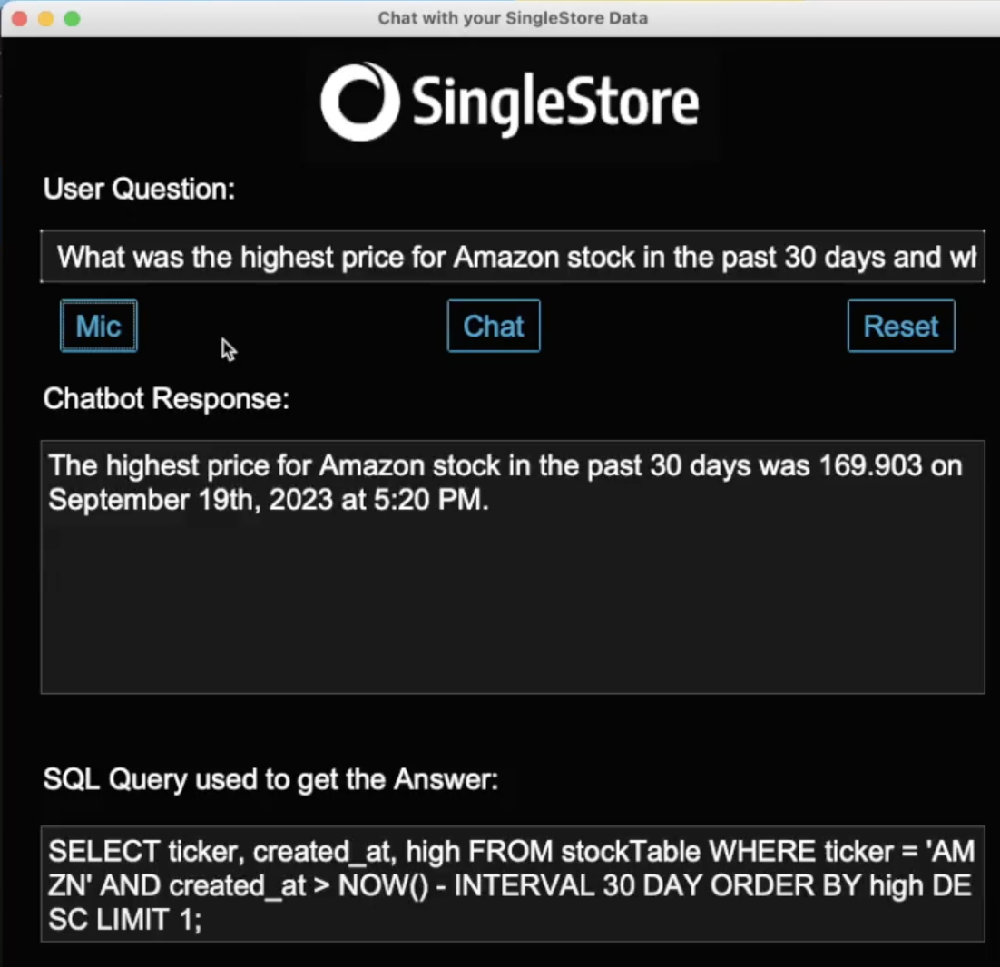

# singlestore_now_llm_demo


 
# Demo Architecture


# Setup
Python version: 3.9
1. Install required packages from requirements.txt
```pip install -r requirements.txt```
2. Update files `apikeys.py` and `s2_connection.py` with appropriate keys and credentials
3. Create database and tables on your SingleStore cluster. Table DDLs can be found in the file `create_tables.sql` or within the python notebook `scrape_financial_data.ipynb`
4. Scrape financial data using the alphavantage api in the notebook `scrape_financial_data.ipynb`
5. Navigate to the singlestore_now_llm_demo in a terminal window and start the chat app 
```python ./path/to/file/llm_app_demo.py```